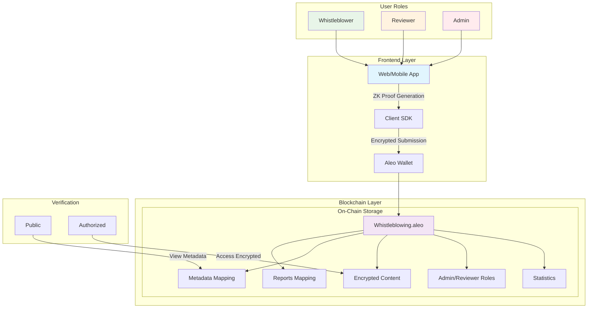
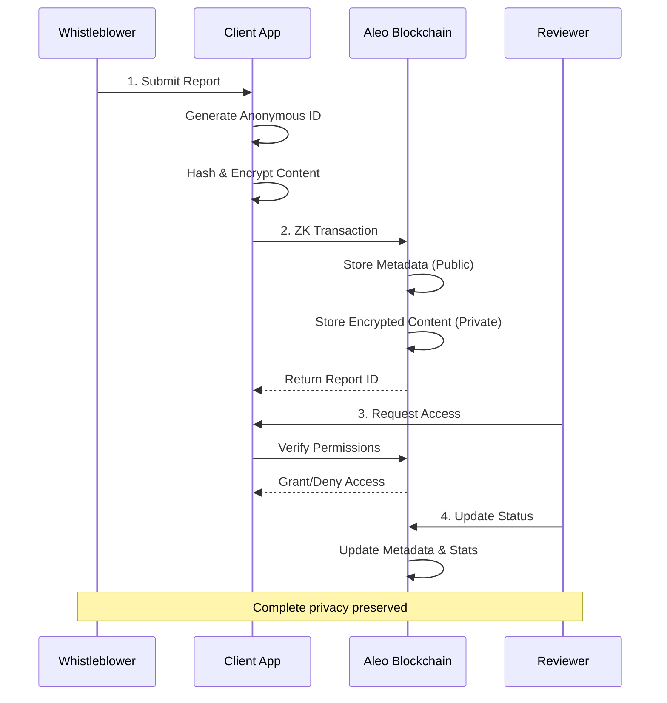
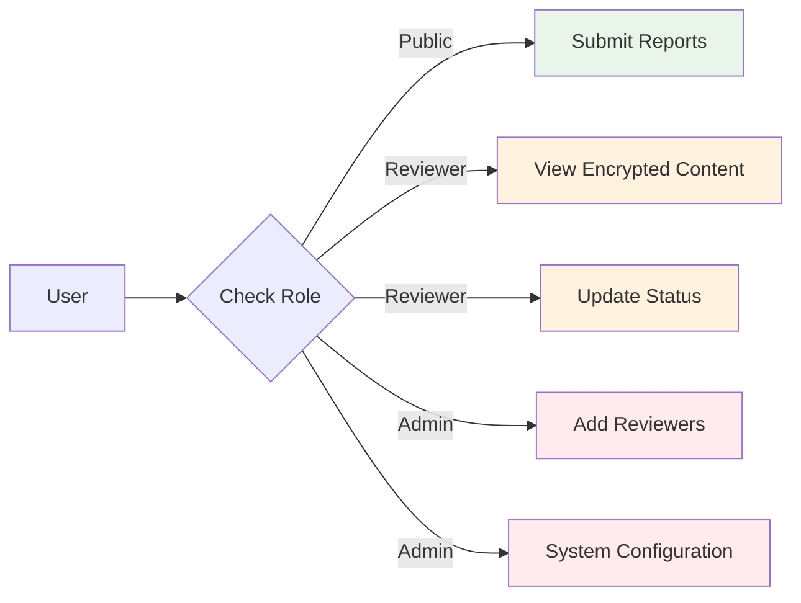

# 🔒 AleoWhistle: Anonymous Whistleblowing System

**Built on Aleo Blockchain | Zero-Knowledge Privacy**


## 🎯 Overview

AleoWhistle is a decentralized, anonymous whistleblowing system built on the Aleo blockchain. It enables secure, private reporting of misconduct while ensuring data integrity and transparency through zero-knowledge cryptography.

## ✨ Key Features

- 🔐 **Complete Anonymity**: Reporters remain anonymous using cryptographic identities
- 🛡️ **End-to-End Encryption**: Optional client-side encryption for sensitive reports
- 📊 **Transparent Governance**: Public metadata with private content
- 🔗 **Immutable Audit Trail**: All actions recorded on Aleo blockchain
- 👥 **Role-Based Access**: Admin and reviewer permissions
- ✅ **Integrity Verification**: Cryptographic proof of report authenticity

## 🏗️ System Architecture



## 📊 Data Flow




## 🚀 Quick Start

### Prerequisites
- Aleo Leo CLI
- Node.js 22+
- Leo wallet / Sheild

### Installation

1. **Clone the repository**
```bash
git clone https://github.com/blockend-dev/AleoWhistle.git
cd AleoWhistle
```

2. **Compile the contract**
```bash
leo build
```

3. **Deploy to testnet**
```bash
leo deploy
```

4. **Initialize the system**
```bash
leo run initialize
```
## 📖 Contract Functions

### Core Functions
| Function | Description | Access |
|----------|-------------|---------|
| `initialize()` | Initialize system | Admin |
| `submit_report()` | Submit anonymous report | Public |
| `update_status()` | Update report status | Admin/Reviewer |
| `add_reviewer()` | Add new reviewer | Admin |


## 🔐 Security Model

### Access Control


## 📈 Statistics Tracking

The system maintains three counters:
- **Total Reports**: All submitted reports
- **Pending Reviews**: Reports under investigation
- **Resolved Cases**: Successfully addressed reports

## 🚧 Hackathon Extensions (Potential)

1. **IPFS Integration**: Store large evidence files off-chain
2. **Reputation System**: Verified whistleblower scores
3. **Multi-sig Escrow**: Reward mechanisms for valid reports
4. **Mobile App**: Cross-platform reporting
5. **AI Analysis**: Automated triaging of reports
6. **Anonymous Messaging**: Secure communication channel


## 📄 License

MIT License - see [LICENSE](LICENSE) file for details

**Built with ❤️ on ALEO**